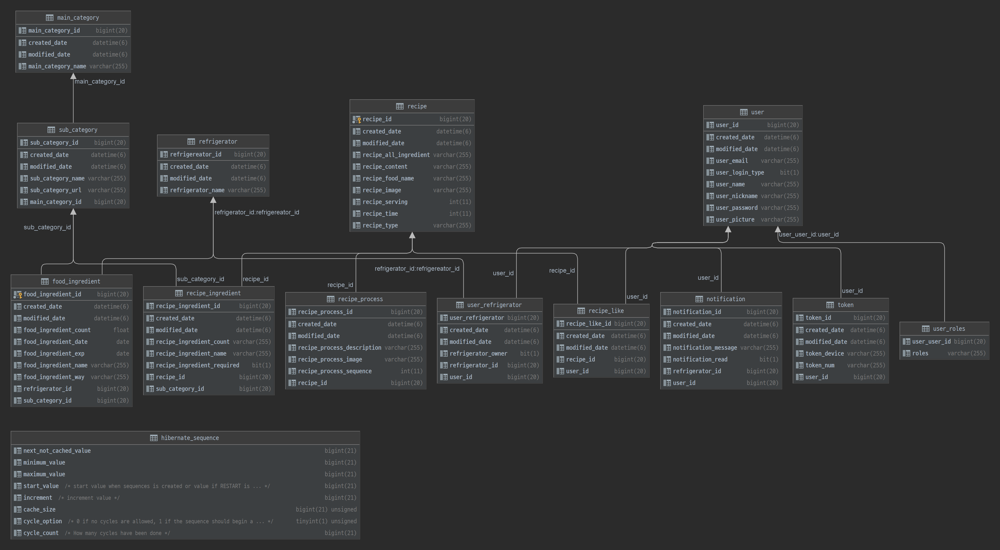

# 데이터베이스 ERD

 

---

- ### user 유저

  - user_id : 유저 고유번호
  - user_email : 유저 이메일
  - user_login_type : 소셜 로그인, 일반로그인
  - user_name : 유저 이름
  - user_nickname : 유저 닉네임
  - user_password : 유저 비밀번호
  - user_picture : 유저 사진
  - created_date : 생성일
  - modified_date : 변경일

---

- ### user_roles 유저역할

  - user_user_id : 유저 아이디
  - roled : 역할
  - created_date : 생성일
  - modified_date : 변경일

---

- ### token 토큰

  - token_id : 토큰 고유번호
  - token_device : 토큰 디바이스 번호
  - token_num : 토큰 번호
  - user_id : 유저 고유번호
  - created_date : 생성일
  - modified_date : 변경일

---

- ### notification 알림

  - notification_id : 알림 고유번호
  - refrigerator_id : 냉장고 고유 번호 
  - user_id : 유저 고유번호
  - notification_read : 읽은 여부
  - notification_message : 알림 메세지
  - created_date : 생성일
  - modified_date : 변경일

---

- ### refrigerator 냉장고

  - refrigerator_id : 냉장고 고유 번호
  - refrigerator_name : 냉장고 이름
  - created_date : 생성일
  - modified_date : 변경일

---

- ### user_refrigerator 유저냉장고

  - user_refrigerator : 유저냉장고 고유 번호 
  - refrigerator_owner : 주인 여부
  - refrigerator_id : 냉장고 고유 번호
  - uesr_id : 유저 고유번호
  - created_date : 생성일
  - modified_date : 변경일

---

- ### recipe 레시피

  - recipe_id : 레시피 고유 번호
  - recipe_all_ingredient : 레시피 모든 재료
  - recipe_content : 레시피 설명
  - recipe_food_name : 레시피 음식 이름
  - recipe_image : 레시피 이미지
  - recipe_serving : 음식 인분
  - recipe_time : 음식 조리 시간
  - recipe_type : 음식 종류
  - created_date : 생성일
  - modified_date : 변경일

---

- ### recipe_like 레시피 좋아요

  - recipe_like_id : 레시피 좋아요 번호
  - recipe_id : 레시피 고유 번호
  - user_id : 유저 고유 번호
  - created_date : 생성일
  - modified_date : 변경일

---

- ### recipe_process  레시피 과정 정보

  - recipe_process_id : 레시피 과정 정보 고유 번호
  - recipe_process_description : 과정 정보 설명
  - recipe_process_image : 과정 정보 사진
  - recipe_process_sequence : 과정 정보 순서
  - recipe_id : 레시피 고유 번호
  - created_date : 생성일
  - modified_date : 변경일

---

- ### recipe_ingredient 레시피 식재료정보

  - recipe_ingredient_id : 레시피 식재료정보 고유 번호 
  - recipe_ingredient_count : 식재료 수량
  - recipe_ingredient_name : 식재료 이름
  - recipe_ingredient_required : 필수재료 여부
  - created_date : 생성일
  - modified_date : 변경일

---

- ### main_category 메인 카테고리

  - main_category_id : 메인 카테고리 고유 번호
  - main_category_name : 메인 카테고리 이름
  - created_date : 생성일
  - modified_date : 변경일

---

- ### sub_category 서브 카테고리

  - sub_category_id : 서브 카테고리 고유 번호
  - sub_category_name : 서브 카테고리 이름
  - sub_category_url : 서브 카테고리 이미지 주소
  - main_category_id : 메인 카테고리 고유 번호
  - created_date : 생성일
  - modified_date : 변경일

---

- ### food_ingredient 식재료

  - food_ingredient_id : 식재료 고유 번호
  - food_ingredient_count : 식재료 수량
  - food_ingredient_date : 식재료 등록 날짜
  - food_ingredient_exp : 식재료 유통기한
  - food_ingredient_name : 식재료 이름
  - food_ingredient_way : 식재료 저장 방법
  - refrigerator_id : 냉장고 고유 번호
  - sub_category_id : 서브 카테고리 고유 번호
  - created_date : 생성일
  - modified_date : 변경일