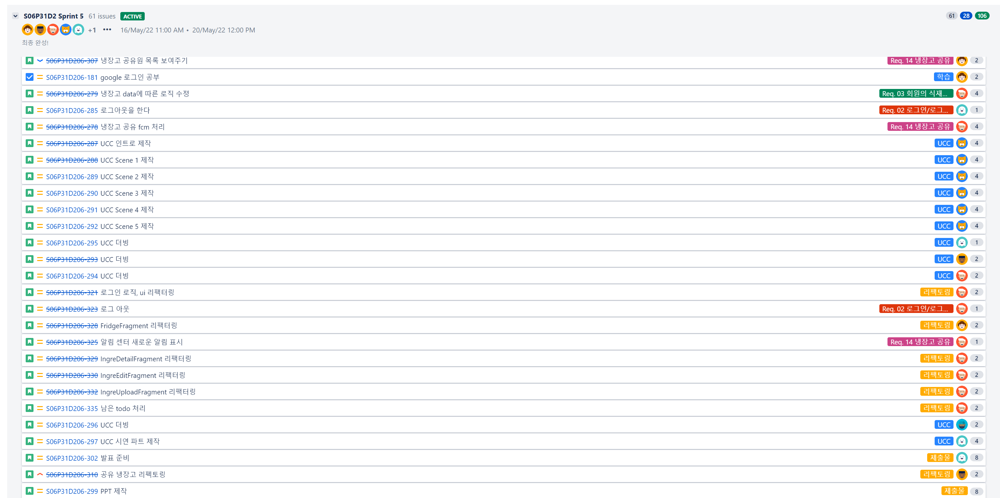
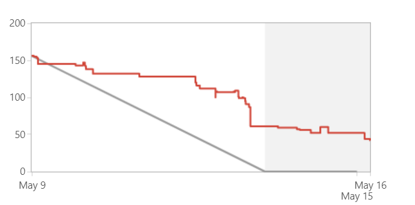

# Jira 이슈관리

## 팀 Jira 규칙

대분류부터 기준으로 `Epic` > `Story` > `task` > `sub-task`의 순으로 작성한다.

1. Epic : 가장 큰 대분류
   - 기획, 산출물, 기능 명세서의 Req 별로 생성하여 가장 큰 단위를 표시한다.
2. Story : 일반적인 업무 진행
   - 어떠한 기능을 구현하고자할 때 Story 단위로 작성한다.
   - 소속 Epic을 명확히 표기해야 한다.
3. sub-task : Story의 상세
   - Story를 더욱 상세한 기능으로 분업할 때 사용한다.

**그외**

1. Sprint : 한 주 단위로 생성하며, 진행상황을 항상 체크하면서 진행합니다.
2. Estimate : 예상 작업 시간으로 처음 작성하여, 마지막 종료하기 전 다시 확인합니다.
   - 각 기능에 따른 시간은 담당 개발자의 자유입니다.
   - 난이도로  story point 1, 2, 4, 8로 정했습니다.
3. 항상 매일 아침/저녁으로 Jira 이슈를 확인하면서 정리합니다.

- Jira 이슈관리를 통해 겹치지 않는 분업이 가능했습니다.

한 주의 시작인 월요일에 일주일의 이슈를 등록했습니다.

스프린트 중간에 새로운 이슈가 생기면 추가로 등록했습니다.